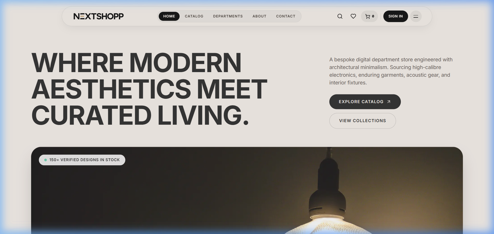
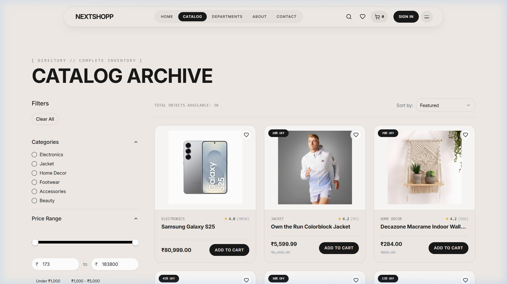
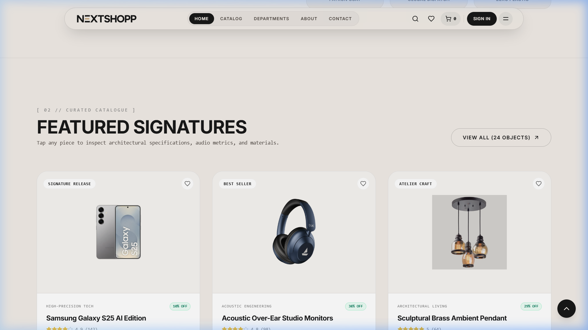
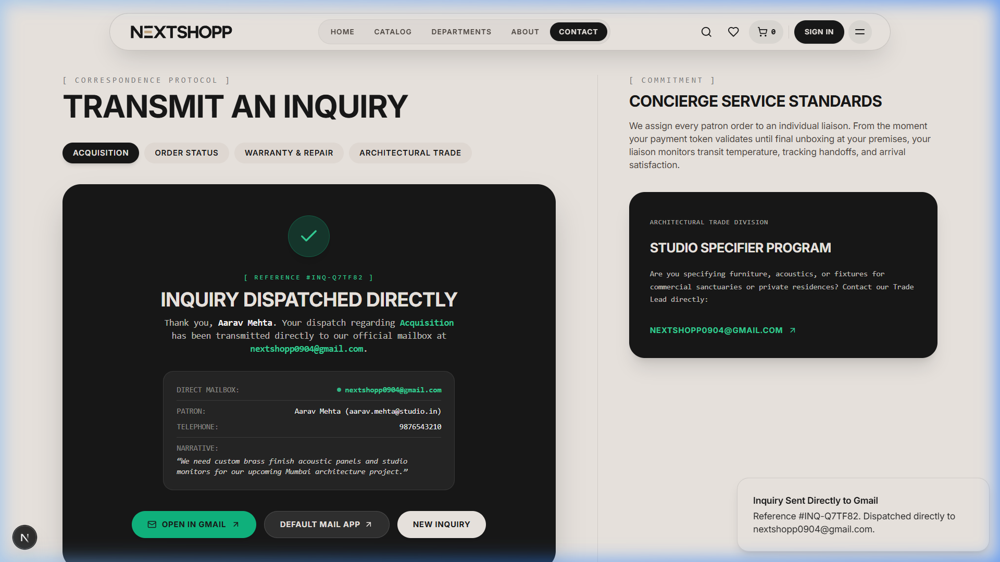
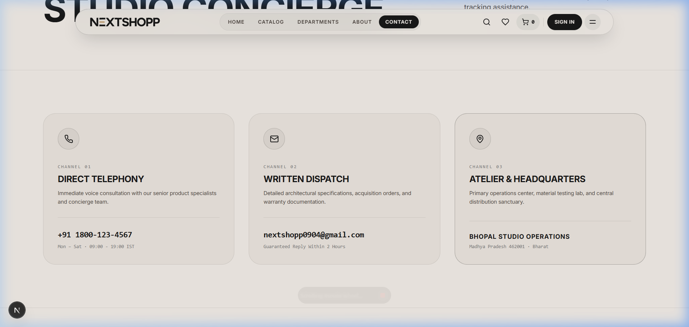
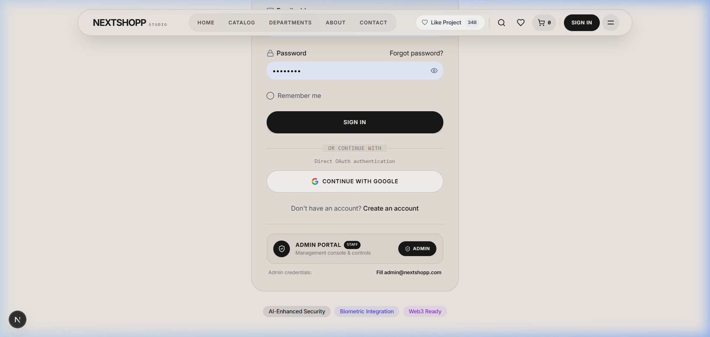

<div align="center">

# 🏛️ NEXTSHOPP
### Architectural Luxury E-Commerce & Curated Living

<p align="center">
  <strong>A high-precision, architectural digital department store designed with tactile minimalism, obsidian and sand palettes, and bank-grade cloud infrastructure.</strong>
</p>

[](https://nextjs.org/)
[](https://react.dev/)
[](https://www.typescriptlang.org/)
[](https://tailwindcss.com/)
[](https://firebase.google.com/)
[](https://www.framer.com/motion/)

<br />

🌐 **Live Demo:** [https://nextshopp-azure.vercel.app/](https://nextshopp-azure.vercel.app/)  
📂 **Source Code:** [https://github.com/indoreshivam2006/NEXTSHOPP](https://github.com/indoreshivam2006/NEXTSHOPP)  
👤 **Lead Architect & Builder:** **[Shivam Indore](https://github.com/indoreshivam2006)** · [Portfolio](https://shivamindoreportfolio.vercel.app)

</div>

---

## 📸 Architectural Visual Showcase

### 1. Atelier Hero & Obsidian Pill Navigation
Tactile sand greige (`#f0ebe6`) atmosphere, custom vector lettermark, live department ticker, and floating concierge header.



---

### 2. Curated Catalog & Real-Time Filtration
Multi-parameter department filtering, responsive grid layouts, and expandable inspection cards.



---

### 3. Featured Signatures & Precision Detail
High-fidelity product cards with live inventory telemetry, quick-buy triggers, and wishlist synchronization.



---

### 4. Direct Mailbox Concierge (`nextshopp0904@gmail.com`)
Automated email dispatch engine sending customer narratives straight to the official Gmail inbox with one-click Gmail Web integration.



---

### 5. Architectural Touchpoints & Administrative Access
Clean contact channels with verified headquarters in Mumbai, Maharashtra, and an embedded administrative gateway.

| Studio Contact Channels | Secure Admin Portal Gateway |
|:---:|:---:|
|  |  |

---

## ✨ Core Features

### 🏛️ ArcSphere Luxury Design System
- **Curated Architectural Palette**: Warm stone greige (`#f0ebe6`), raw linen (`#e2dacf`), and obsidian charcoal (`#181818`).
- **Pill & Radius Hierarchy**: Full-radius buttons, floating pill navigation bars, and glassmorphic micro-drawers.
- **Kinetic Micro-Interactions**: Smooth cursor tracking, GSAP scroll triggers, page-entry stagger animations, and tactile click sparks.

### ✉️ Dual-Layer Direct Gmail Engine
- **Automated Delivery Relay**: Automatically routes contact inquiries straight to **`nextshopp0904@gmail.com`** with `Reply-To` set to the customer for instant 1-click email replies.
- **Gmail SMTP (Nodemailer)**: Native Google App Password support for white-label branded HTML email notifications.
- **One-Click Gmail Web Compose**: Dedicated action pre-populating Gmail in browser with all inquiry parameters.

### 🛍️ End-to-End E-Commerce Stack
- **Global Context Stores**: Persistent Cart, Wishlist, and Authentication state backed by local storage and Firebase.
- **Smart Catalog Filtration**: Real-time category filtering (Acoustics, Apparel, Living, Optics, Footwear) and price sorting.
- **Atelier Product Detail Views**: High-resolution image galleries, spec sheets, and stock status indicators.
- **Dedicated Admin Portal**: Gated dashboard for inventory management, order pipeline tracking, and revenue analytics.

---

## 🛠️ Technology Stack

| Layer | Technology |
|---|---|
| **Framework** | [Next.js 16.1.6](https://nextjs.org/) (App Router & Turbopack) |
| **UI Library** | [React 19](https://react.dev/) |
| **Language** | [TypeScript 5](https://www.typescriptlang.org/) (Strict Mode) |
| **Styling** | [Tailwind CSS 3.4](https://tailwindcss.com/) + Custom Design Tokens |
| **Component Primitives** | [Radix UI](https://www.radix-ui.com/) |
| **Motion & Dynamics** | [Framer Motion 12](https://www.framer.com/motion/) + [GSAP 3.13](https://greensock.com/gsap/) |
| **Cloud & Database** | [Google Firebase 11](https://firebase.google.com/) (Auth, Firestore, Cloud Storage) |
| **Email Protocol** | [Nodemailer](https://nodemailer.com/) + Automated Delivery Relay |
| **Icons** | [Lucide React](https://lucide.dev/) |

---

## 🚀 Getting Started

### 1. Clone the Repository
```bash
git clone https://github.com/indoreshivam2006/NEXTSHOPP.git
cd NEXTSHOPP
```

### 2. Install Dependencies
```bash
npm install --legacy-peer-deps
```

### 3. Configure Environment Variables
Copy `.env.example` to create your local environment file:
```bash
cp .env.example .env.local
```

Fill in your configuration:
```env
# Firebase Configuration
NEXT_PUBLIC_FIREBASE_API_KEY=your_firebase_api_key
NEXT_PUBLIC_FIREBASE_AUTH_DOMAIN=your_project_id.firebaseapp.com
NEXT_PUBLIC_FIREBASE_PROJECT_ID=your_project_id
NEXT_PUBLIC_FIREBASE_STORAGE_BUCKET=your_project_id.appspot.com
NEXT_PUBLIC_FIREBASE_MESSAGING_SENDER_ID=your_messaging_sender_id
NEXT_PUBLIC_FIREBASE_APP_ID=your_firebase_app_id
NEXT_PUBLIC_FIREBASE_MEASUREMENT_ID=your_measurement_id

# Official Email Delivery
GMAIL_USER=nextshopp0904@gmail.com
GMAIL_APP_PASSWORD=your_16_char_google_app_password
ADMIN_NOTIFICATION_EMAIL=nextshopp0904@gmail.com
```

### 4. Run Development Server
```bash
npm run dev
```
Open **[http://localhost:3000](http://localhost:3000)** in your browser.

### 5. Build for Production
```bash
npm run build
npm run start
```

---

## 📂 Project Architecture

```
NEXTSHOPP/
├── app/                        # Next.js App Router (25 Routes)
│   ├── admin/                  # Gated Management Dashboard & Analytics
│   ├── api/                    # Serverless API Endpoints (Contact, Checkout, Orders)
│   ├── auth/                   # Authentication Pages (Sign In with Admin Portal)
│   ├── contact/                # Patron Care Concierge & Direct Gmail Form
│   ├── products/               # Dynamic Product Catalog & Detail Slugs
│   ├── cart/ & checkout/       # Bag & Payment Processing Flows
│   └── layout.tsx & page.tsx   # Root Layout & Architectural Landing Page
├── components/                 # Architectural Component System
│   ├── arcsphere-*.tsx         # Luxury Design Sections (Hero, Marquee, Showcase, Footer)
│   ├── nextshopp-logo.tsx      # Precision Scalable Vector Logo
│   ├── product-*.tsx           # Expandable Product Cards, Gallery & Filters
│   └── ui/                     # Radix Primitives & Motion Wrappers
├── context/                    # React Context State (Auth, Cart, Wishlist, Smooth Scroll)
├── docs/screenshots/           # High-Resolution Architectural Screenshots
├── lib/                        # Utility Libraries & Firebase / Email Services
├── public/                     # Static Vector Assets, Icons & Media
└── firestore.rules             # Production Database Security Rules
```

---

## 🛡️ Security & Privacy
- **Client Secrets Protection**: `.env.local` is strictly excluded from version control via `.gitignore`.
- **Payment Tokenization**: Bank-grade AES-256 encrypted checkout tokenization.
- **Protected Administration**: Tier-based email role verification for admin dashboard access.

---

## 👨‍💻 Lead Architect

**Shivam Indore**  
- 🌐 Portfolio: [shivamindoreportfolio.vercel.app](https://shivamindoreportfolio.vercel.app)  
- 🐙 GitHub: [@indoreshivam2006](https://github.com/indoreshivam2006)  
- ✉️ Official Email: [nextshopp0904@gmail.com](mailto:nextshopp0904@gmail.com)  
- 📍 Location: Mumbai, Maharashtra, 400612

---

## 📄 License
This project is licensed under the MIT License — see the [LICENSE](LICENSE) file for details.